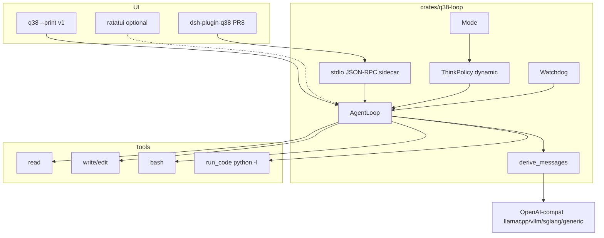
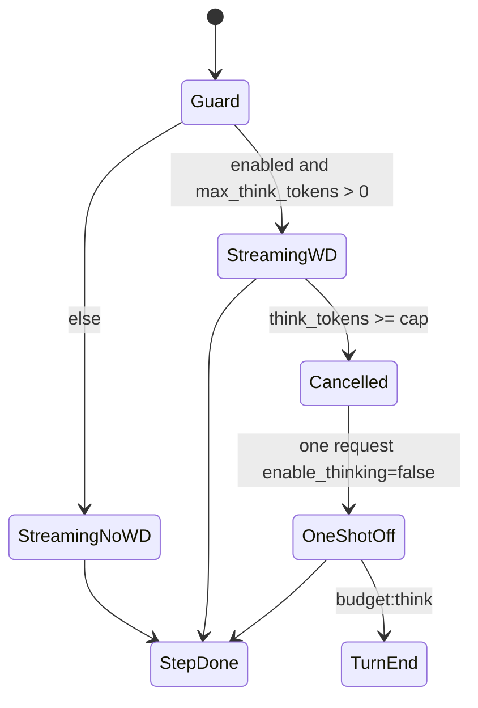

# q38-agent：面向 Qwen3.5 家族的推理经济型编码 Agent Harness

| 字段 | 值 |
|---|---|
| 文档标题 | q38-agent Design Document |
| 工作名 | `q38-agent`（非产品品牌，仓库 / CLI 名） |
| 作者 | Design draft for user William |
| 日期 | 2026-08-18 |
| 状态 | Draft（rev 5，家族化：不锁单一引擎/量化） |
| 优化对象 | **Qwen3.5 家族**（3.5 / 3.6 / 3.8；含同架构 dense / MoE）。不针对某一 GGUF 或某一推理框架 |
| 开发参考盒 | Qwen3.8-27B **Unsloth UD-Q8** + **llama.cpp** + AMD **MI210**（校准与日常开发，不是唯一目标） |
| 参考盒实测 | decode **~40+ tok/s**；prefill **稳定 1000+ tok/s**；MTP **开** |
| 范围 | 全新独立 **Rust** 仓库；可挂进 dsh（sidecar）；**不是** tevarn 功能 |
| v1 UI | **`q38 --print`**（TUI 出门证外；后期可选 `ratatui`） |
| 引擎 profile | `auto` / `llamacpp` / `vllm` / `sglang` / `generic`（OpenAI-compat） |

---

## Overview

Nous Hermes Agent 把云端 frontier harness 扣在本地 27B 上：全量 system + 全量 tool schema，再叠默认 `reasoning_effort=xhigh` 的数千 thinking token。用户这台盒子上 prefill 已经是 **1000+ tok/s**（1.2k 前缀 ≈ 1.2s，12k Hermes 前缀 ≈ 12s），decode **~40 tok/s**。因此 **Hermes 慢的主因不是 prefill，而是 thinking tokens + 工具轮次 + 上下文膨胀**。8k think @ 40 tok/s ≈ **200s**，一轮就能吃掉三分钟。

`q38-agent` 是一台 **推理经济控制器**：哲学底盘取自 Pi（四工具、短前缀、全程可观测、YOLO），速度武器取自 dsh Code mode（一次 `run_code` 消化多步文件/shell），策略层对准 **Qwen3.5 家族契约**（hybrid thinking、`enable_thinking` / `reasoning_effort` / `preserve_thinking`、rendered chat template、XML+OpenAI 双工具面、可选 MTP）。实现是 **全栈 Rust**（`q38-loop` 库 + `q38` CLI），并承诺用薄 TypeScript 插件把同一 loop **挂进 dsh**（stdio JSON-RPC sidecar）。

**引擎和量化是 adapter，不是产品定义。** llama.cpp + UD-Q8 + MI210 只是开发/校准参考盒；同一套 loop 必须能打 vLLM / SGLang / 其它 OpenAI-compat，以及 GGUF / FP8 / AWQ / GPTQ / NVFP4 等权重。不针对某一量化「特调解码」，只针对家族会共同踩的坑：胖前缀、默认 xhigh、模板把 effort 插在 offset 0、think 炸窗、工具 XML。

v1 出门证：**`--print` + 四工具 loop + 动态 ThinkPolicy + Code mode + 家族能力 probe**。参考盒上必须绿；至少再有一个非 llama.cpp profile 的 builder 单测 + 一份对照 checklist。TUI 与 dsh 插件是出门证之后的承诺项（PR8）。

---

## Background & Motivation

### 当前状态（开发参考盒，不是唯一目标）

| 项 | 值 |
|---|---|
| 引擎 | **llama.cpp**（llama-server，OpenAI-compatible）——参考盒 |
| GPU | AMD **MI210**（后端：ROCm/HIP 或 Vulkan，PR0 probe 确认，不猜死） |
| 量化 | Unsloth **UD-Q8** GGUF——参考盒；**不锁定** |
| MTP | 参考盒 **开**；其它引擎/量化可能没有，probe 记 `mtp=yes\|no` |
| 空上下文 decode | **~40+ tok/s**（参考盒） |
| Prefill | **稳定 1000+ tok/s**（参考盒） |
| 用户现状 | thinking **默认开**；希望 agent **动态调节深度** |

短聊可接受。Hermes 仍「特别慢」：官方承认 *Slow first response (prefill)*；issue #61265 显示本地 OpenAI-compat 上超大 prompt 会卡死。参考盒上 12k 前缀只要 ~12s，真正致命的是 **xhigh 几千 think × 多轮 × 上下文越积越厚**。换到 prefill 更慢的引擎/量化时，胖前缀会重新变成主凶——所以家族优化仍然包含前缀合同，只是权重随 `probe.json` 变。

### 优化对象：Qwen3.5 家族，不是某一 GGUF

Qwen3.8 官方写明建在 **Qwen3.5 架构**上。本 harness 的策略层对准这条线共同的 agent 契约，而不是 27B UD-Q8 的解码癖好。

**家族内视为一等公民（v1 必须正确）：**

| 契约 | 3.5 | 3.6 | 3.8 | harness 怎么处理 |
|---|---|---|---|---|
| `enable_thinking` 默认真、可按请求关 | 有 | 有 | 有 | 默认 on；`/fast` 关；probe 用 think tokens≈0 判定 |
| `reasoning_effort` | 代际用词可能不同 | 演进中 | `xhigh` / `medium` / `low` | 规范成内部 `off\|low\|medium\|xhigh`；profile 映射到该代模板合法值；未知值 **省略键**，禁止发 `null` |
| `preserve_thinking` | 早期模板常缺/有 cache 毒 | 正式引入 | 默认 on | 日常 `false`（官方 last-user-query）；`think` 模式 `true`。模板不认则 probe 记 `preserve=n/a`，不再传 |
| 思考默认 xhigh / 很长 | 常见 | 常见 | 官方默认 xhigh | **禁止日常默认 xhigh**；cap 512/2048/4096 |
| 官方 Jinja 在 offset 0 注入 effort 句 | 视模板 | 视模板 | 已核实 | 改档 = prefix miss；tools+system 仍冻结 |
| OpenAI `tools` + 模型爱发 XML `<tool_call>` | 常见 | 常见 | 已核实 | 双解析合并 |
| MTP / 投机解码 | 部分权重有 | 常见 | 27B 有 | **可选加速**，不是功能依赖 |
| Hybrid GDN + 全注意力（KV 比纯 dense 省） | 3.5 起 | 是 | 是 | 参考盒已开 native 262k；不特化 kernel；禁止用静态 YaRN 假装 262k |
| 视觉编码器 | 部分 | 部分 | 27B 有 | v1 不用 |

**明确不优化 / 不承诺：**

- 某一量化的数值 extra（UD-Q8 vs Q4 vs FP8 vs AWQ 的解码调参）
- 某一引擎的私有 batch / 调度（除 prefix cache / MTP 探测开关）
- Qwen2.5、QwQ、非 thinking 的纯 instruct、其它厂的模板
- 视觉 / 视频 / **1M 静态 YaRN** 当产品功能（native 262k 是 coding 基线）

量化与引擎的差异全部进 **profile + probe**：同一套 loop，换 `config.profile` 和端点即可。参考盒用来定延迟公式和日常开发；质量门跑在「当前连上的那个端点」，并在报告里写清 `family/engine/quant`。

### Qwen3.8-27B 为何不需要 Hermes 式 10k system

[官方模型卡](https://huggingface.co/Qwen/Qwen3.8-27B)（约 2026-08-14，Apache 2.0）：

- Dense 27B causal LM，原生视觉编码器（v1 不用）。
- 64 层，hidden 5120，FFN 17408。Hybrid attention：16 组 `(3× Gated DeltaNet→FFN + 1× Gated Attention→FFN)`。
- 只有 16 层全注意力持有常规 KV。**FP16 KV ≈ 64 KiB/token**（8-bit 权重 ≠ 8-bit KV）。8K ≈ 0.5 GB，32K ≈ 2 GB，262K ≈ 16 GB。
- 原生 262,144；YaRN 到 1M。**静态 YaRN 伤短文本，默认关。**
- 训练带 **MTP**，与本机「MTP 已开」对齐。
- 厂商报告（vendor-reported）：SWE-bench Pro 61.7、Terminal Bench 2.1 73.0、DeepSWE 1.1 42.2、LiveCodeBench v6 90.3（多数用 Claude Code harness）——足够说明不需要 10k Hermes system。OSWorld / AndroidWorld / CoWorkBench 是 computer-use，不拿来当 coding 论据。

Thinking 契约：

| 项 | 官方默认 | 对本机 40 t/s 的含义 |
|---|---|---|
| thinking | **ON** | 保持开，但默认 **low**，不是 xhigh |
| `reasoning_effort` | **xhigh** | **禁止日常默认**。8k think ≈ 200s |
| `preserve_thinking` | **ON** | 日常 `false`（官方：只留最后一条真实 user 之后的 thought）；`think` 模式 `true` |
| 官方 agent 长度 | reasoning 262k / final 131k | **禁止照抄** |
| 官方警告 | 降 effort 不一定缩短总时间 | 升级要有谓词，不能一失败就 xhigh |

官方 `chat_template.jinja` 在 tools / 客户端 system **之前**注入 effort 句：

| `enable_thinking` + `reasoning_effort` | 注入（offset 0） |
|---|---|
| true + `xhigh` | `"Reasoning effort is set to xhigh. Please think carefully..."` |
| true + `low` | `"Reasoning effort is set to low. Keep your thinking brief..."` |
| true + `medium` | 不注入该句 |
| `enable_thinking=false` | 整段跳过 |

因此 **改 effort / 开关思考 = rendered 前缀从 offset 0 分叉 = prefix cache 全 miss**。本机 1.2k 前缀 miss ≈ **1.2s**，**可接受**。动态调深度 **不 fork session**。tools + system 仍保持字节稳定，这样 miss 只发生在政策变更的那一步，随后在新前缀上重新命中。

其它模板事实（实现约束，未改）：

1. 有 tools 时 system turn 重建为 `# Tools` + `<tools>` + XML preamble + 客户端 system。预算按 **Jinja 渲染后** 计。
2. Jinja 用 `tool \| tojson`。出站 `tools` 必须是稳定对象。
3. `preserve_thinking` 按 `last_query_index` 决定是否输出历史 `<think>`。缺 `reasoning_content` 且 preserve=true 会包空 think 标签。
4. thinking-off 的 generation prompt 是空 `<think>\n\n</think>\n\n`。Probe 用 think tokens ≈ 0 判定，不看 HTTP 200。
5. 无真实 user turn → 500 `'No user query found in messages.'`
6. 模型常发 XML `<tool_call>`，即使客户端走 OpenAI `tools`。

采样（客户端下发完整官方表）：

- Thinking：`temp=1.0, top_p=0.95, top_k=20, min_p=0.0, presence_penalty=0.0, repetition_penalty=1.0`
- Instruct / off：`temp=0.7, top_p=0.80, top_k=20, min_p=0.0, presence_penalty=1.5, repetition_penalty=1.0`

参考盒用 Unsloth UD-Q8 GGUF + llama.cpp。社区对部分官方 FP8 有 agent 退化报告——那是 **质量观察**，不是「禁止其它量化」。换 FP8 / AWQ / GPTQ / 更低 bit GGUF 时，用同一套三任务质量门决定能不能当日常端点，而不是在文档里锁死一种权重。

### 延迟模型（按参考盒校准，公式随 probe 走）

以参考盒数字为 **开发机验算**（PR0 probe 复核，公式不变；换引擎/量化后用新 `probe.json` 重算门）：

- Prefill **1000 tok/s**，decode **40 tok/s**
- overhead **2.5s**（LAN + schedule）

| 场景 | Prompt | Think | Visible | Rounds | Prefill | Decode | 约墙钟 |
|---|---|---|---|---|---|---|---|
| 短聊，thinking off | 400 | 0 | 200 | 1 | 0.4s | 5s | **~8s** |
| 短聊，low think 512 | 400 | 512 | 200 | 1 | 0.4s | 18s | **~21s** |
| Hermes 首轮 12k + xhigh 8k + 400 | 12000 | 8000 | 400 | 1 | 12s | 210s | **~3.7 min** |
| Hermes 12 轮，每轮 8k think | 12k→30k | 8k×12 | 300×12 | 12 | 递增 | ~2400s think | **四十分钟级** |
| 瘦 harness 1.2k，**low/512**，4 轮，200 out | 1.2k→4k | 512×4 | 200×4 | 4 | ~1–4s | 4×(12.8+5) | **~75–90s** |
| 同上，`/fast` thinking off | 1.2k→4k | 0 | 200×4 | 4 | ~1–4s | 20s | **~25–35s** |
| 中途改 effort（1.2k 前缀 miss） | 1.2k | — | — | — | **~1.2s** | 0 | 可接受 |
| 刚 compact，~12k suffix 重物化 | 12k | 0 | 200 | 1 | 12s + 2.5s | 5s | **~20s TTFT** |

四个乘数（权重 **随盒子变**，由 probe 的 prefill/decode 决定）：

1. **Thinking tokens**：参考盒上是主凶（8k ≈ 200s；low/512 ≈ 13s）。禁止默认 xhigh——这条对全家都成立。
2. **工具轮次**：每轮 = 一次 generate（+ 可能的 think）。Code mode 把 N 轮收成 1 次。
3. **上下文增长**：thought + tool dump 让下轮 prefill 变慢，但真实 coding 必须留住 thread。工作窗 **262,144**；只在 prefix + generation reserve 超过窗时 `budget:context`。禁止为省 KV 反复 compact。
4. **Prefill / prefix cache**：参考盒上次凶（冷 1.2k ≈ 1.2s）。prefill 落到 100–200 tok/s 的引擎上会重新变成主凶，所以 tools+system 仍必须稳定。effort 变更在快 prefill 上接受 1–2s miss；慢 prefill 上 TUI 要标 `cache_invalidated=policy`。

### 从 dsh / Pi 偷什么、不偷什么

**dsh：** 偷 Minimal / Code mode、JSONL 真源、turn/step、`run_code`。不偷 Cordis、Standard 动物园、MCP-as-default。**不 fork dsh 仓库。** 用户要求 **能挂进 dsh 跑**：用薄 TS 插件 + Rust sidecar，而不是把 loop 写成 Cordis 插件核。

**Pi：** 偷四工具、短前缀、YOLO、可观测、abort、结果拆分、session resume。形状可移植。**Pi spike 已取消**（用户选择 Rust 重写）。不要对用户说「去用 Pi」。

---

## Goals & Non-Goals

### Goals（v1 出门证）

- 任意 **Qwen3.5 家族**、OpenAI-compat 端点上，用 `q38 --print` 完成真实改文件。参考盒（llama.cpp + MI210 + UD-Q8）必须绿。
- 默认 `agent`：**thinking on / effort=low / max_think_tokens=512**；harness 与 `/think` `/fast` 可在 **同一 session** 里调深度。
- `agent` rendered 前缀（该代官方 Jinja，含 effort 句 + tools XML）≤ **1200 tokens**。tools+system 跨 step 字节稳定。
- 四工具 + Code mode（`run_code` = 用户等价 **Python 子进程**，harness 本身是 Rust）。
- Append-only JSONL，`derive_messages()` 唯一构包。
- PR0 probe：探测 `family` / `profile` / 量化名、prefill/decode、按请求开关思考、`preserve_thinking` 是否生效、MTP 有无、prefix cache 字段。
- 三任务必须 **改对文件 / 测试绿**；报告写明当时的 family/engine/quant。
- v1 带齐 `llamacpp` / `vllm` / `sglang` / `generic` 请求构造；至少 llamacpp 在参考盒上 live 绿，其它 profile 用 fixture 矩阵单测。

### Non-Goals（v1）

- MCP、浏览器工具、sub-agent、workflow、PTY、LSP
- 把 Cordis / dsh Web UI / Standard 模式搬进 Rust
- Vision / Hermes memory / 权限剧场
- 1M / 默认静态 YaRN（native 262k 是 coding 基线；短窗 + 反复 compact 体验不可接受）
- tevarn 集成
- TUI（可选后期 `ratatui`）
- `run_code` 当沙箱
- 默认 xhigh
- Python / Node 实现 loop（dsh 插件那一层 TS 除外）

---

## Key Decisions

| # | 决策 | 选择 | 理由 |
|---|---|---|---|
| D1 | 交付形态 | **全栈 Rust**：`crates/q38-loop` + `q38` CLI。dsh 用薄 TS 插件 + **stdio JSON-RPC sidecar** 挂载。Pi spike **取消**。Python 方案 **否决** | 用户终裁。不重写 Cordis。standalone 与 dsh 共用同一 loop |
| D2 | 产品定位 | **推理经济控制器** | 参考盒主凶是 think + 轮次；慢 prefill 上前缀也会变主凶 |
| D3 | 默认模式 / 思考 | **`agent` + thinking on + `effort=low` + cap 512** | 用户要默认开、动态深度；xhigh 单轮可 200s |
| D4 | 速度武器 | **Code mode / `run_code`**；默认同样 **low/512**，`/fast` 可关 | 少轮次；512 think ≈ 13s，可接受 |
| D5 | 前缀合同 | **tools[] + system 字节稳定**。`(enable_thinking, effort, preserve)` **允许**中途变，变则 `cache_invalidated=policy`。参考盒 miss ≈ 1–2s | 官方模板把 effort 插在 offset 0 |
| D6 | 深度怎么调 | **同一 session 内变更，不 fork。** Harness 策略 + slash `/think low\|medium\|xhigh\|off` `/fast`。**不加** `set_thinking` 工具（避免涨 schema）。xhigh 仅显式 `/think` 或硬任务分类器 | 1–2s miss 可接受；fork 每调一次会拆断 JSONL |
| D7 | `preserve_thinking` | 日常 **`false`**（官方 last-user-query）。`think` 模式 **`true`**。禁止每 step last-1。v1 无 compact，超窗 `budget:context` | 与官方模板一致；effort 变不改这条除非用户进 `/mode think` |
| D8 | 工作上下文 | **262,144**（与 Qwen3.8 native `n_ctx` 对齐）。prefix 计量留 generation reserve。无 compact | 真实 coding 不能靠反复压缩；短窗体验极差 |
| D9 | 工具面 | `agent`/`think` 四工具；`code`：`run_code`+`read`+`bash`。skills 不进 schema | 冻结 tool JSON |
| D10 | Session | Append-only JSONL + `derive_messages()`。`policy` 事件记录深度变更。`/mode` 才 fork（工具集变） | 模型可见 ⇒ 已入日志 |
| D11 | 安全 | YOLO；`write`/`edit` workspace-relative；`bash`/`run_code` 与用户同权 | 不变 |
| D12 | 服务端 | **家族合同 + 多引擎 profile**。`profile=auto\|llamacpp\|vllm\|sglang\|generic`。开发机默认 `llamacpp`。checklist 分「家族共性」与「引擎附录」 | 用户补充：不要只为一种框架/量化优化 |
| D13 | UI | `--print` 是 v1；TUI 可选 `ratatui` | 先验证经济学 |
| D14 | 采样 | 两套官方表字段齐全，随 `enabled` 切换 | 缺字段掉进 server 默认 |
| D15 | 262k / YaRN | **用 native 262k**。默认关静态 YaRN（伤短文本）。不要靠 YaRN 把 32k 权重硬拉到 262k | 官方：静态 YaRN 伤短文本；全家都适用 |
| D16 | 度量 | Vendor **按代** 三件套（`qwen35` / `qwen36` / `qwen38`）。Rust：`tokenizers` + **`minijinja`** 渲染 **该代** 官方 `chat_template.jinja`。CI 锁渲染字节。可选对照端点 `/tokenize` | 3.5/3.6/3.8 模板不完全相同 |
| D17 | dsh 挂载 | **PR8**（出门证后承诺）：`dsh-plugin-q38` 驱 sidecar，同一 JSONL | 用户要求能在 dsh 里跑 |
| D18 | 量化 / 引擎 | **不锁定**。参考盒 = UD-Q8 + llama.cpp + MI210。权重/引擎写进 `probe.json` 与 bench 报告 | 用户补充：可扩散；质量门随端点走 |
| D19 | tevarn | **不集成** | 用户终裁 |
| D20 | 优化边界 | 只做 **Qwen3.5 家族 agent 契约**（thinking / 模板 / 前缀 / 轮次 / 工具解析）。不做单量化 kernel 特调 | 换 GGUF/FP8/AWQ 或 vLLM/SGLang 时 loop 行为不变 |

---

## Proposed Design

### 架构分层

```
q38 --print（v1） / 可选 ratatui / dsh UI（PR8 消费同一事件流）
        ↓
ThinkPolicy（默认 low；slash + harness 可中途改）
        ↓
q38-loop（Rust）+ code-mode 子进程
        ↓
Tools：read / write / edit / bash / run_code
        ↓
Family request builder（llamacpp | vllm | sglang | generic；永不发 JSON null）
        ↓
任意 OpenAI-compat 端点 — 参考盒：llama.cpp / MI210 / UD-Q8 / MTP
```



```mermaid
sequenceDiagram
    participant DSH as dsh-plugin-q38
    participant Side as q38-sidecar
    participant Loop as q38-loop
    participant API as OpenAI-compat

    DSH->>Side: JSON-RPC stdin: turn.start
    Side->>Loop: same API as CLI
    Loop->>API: POST /v1/chat/completions
    API-->>Loop: stream deltas
    Loop-->>Side: session events
    Side-->>DSH: stdout JSON-RPC notify
    Note over DSH: dsh UI 只渲染事件，不跑 Cordis loop
```

### 仓库骨架

```
q38-agent/
  Cargo.toml                       # workspace
  crates/
    q38-loop/                      # 纯库：derive、policy、adapter、sidecar server
    q38-cli/                       # q38 二进制（--print / probe）
    q38-tools/                     # read/write/edit/bash + truncate
    q38-code-mode/                 # run_code 子进程
    q38-bench/                     # PR4
  plugins/
    dsh-plugin-q38/                # 薄 TypeScript；PR8
  third_party/qwen-family/
    qwen35/   # tokenizer.json + tokenizer_config.json + chat_template.jinja + SHA256
    qwen36/
    qwen38/
  docs/serve-checklist.md
  tests/
```

v1 依赖（刻意少）：`serde` / `serde_json`、`tokio`（stream）、`reqwest`（streaming HTTP；若以后要同步可换 `ureq`）、`clap`、`tokenizers`（Rust）、`minijinja`（官方模板）、`nix` 或 `command-group`（killpg）。**不**引入 `transformers`、PyO3 loop、LangChain、MCP。TUI 若做：`ratatui`，单独 crate。

配置 `~/.q38-agent/config.toml`：

```toml
[server]
base_url = "http://HOST:PORT/v1"
api_key = "local"
model = "Qwen3.8-27B-UD-Q8"    # 以 /v1/models 实际名为准；换端点就换名
profile = "auto"               # auto | llamacpp | vllm | sglang | generic
family = "auto"                # auto | qwen35 | qwen36 | qwen38
connect_timeout_s = 5
read_timeout_s = 1800

[context]
working_window = 262144
hard_cap = 262144
compact_ratio = 0.70           # unused while compact is off
agents_md_max_tokens = 800

[policy]
default_mode = "agent"
default_effort = "low"         # agent/code 默认
max_think_tokens_low = 512
max_think_tokens_medium = 2048
max_think_tokens_xhigh = 4096  # 仅显式 /think
max_steps = 80
max_steps_think = 100
max_wall_seconds = 1800
max_tokens = 8192
think_mode_max_tokens = 16384

[features]
code_mode = true
tui = false
skills_auto_catalog = false
workspace_write_only = true

[sidecar]
transport = "stdio-jsonrpc"    # 推荐默认
socket_path = ""               # 若改 unix 才用

[tools]
read_default_lines = 2000
result_max_chars = 50000
result_head_chars = 32000
result_tail_chars = 12000

[code_mode]
timeout_s = 60
inherit_env = true
```

### CLI / workspace / abort

```
q38 [--workspace DIR] [--print] [--mode chat|agent|think|code]
    [--session ID] [--new]
    [--think low|medium|xhigh|off] [--fast]
    [--sidecar]                  # stdio JSON-RPC；给 dsh 插件用
    [--no-agents-md] [--agents-md-head]
    [PROMPT]
```

| 规则 | 行为 |
|---|---|
| `--workspace` 缺省 | `pwd` |
| `--print` + PROMPT / stdin | 与 rev 3 相同 |
| `--sidecar` | 不读 TTY prompt；从 stdin 读 JSON-RPC |
| session | `~/.q38-agent/sessions/<id>.jsonl`，`0600`，排他 flock |
| abort | 取消 HTTP；bash/`run_code` 走进程组 `killpg` |
| 截止期 | `max_wall_seconds=1800`；`read_timeout_s=1800` |

`/mode` **fork**（工具集变，必须新前缀）。`/think` `/fast` **不 fork**，只 append `policy`。

### 模式

| Mode | 可见工具 | 默认 ThinkPolicy | 何时 |
|---|---|---|---|
| `chat` | 无 | **off**（问答不烧 13s） | 解释、贴代码 |
| `agent`（默认） | 四工具 | **on / low / 512**，`preserve=false` | 日常编码 |
| `think` | 四工具 | on / **medium** / 2048，`preserve=true` | 难 debug |
| `code` | `run_code`+`read`+`bash` | **on / low / 512**，`preserve=false` | 多文件 |

`/mode` 才复制 JSONL 并 **替换第一条** `session/start`（工具 schema 变）。深度调节留在本文件。

### Thinking 政策（动态，同一 session）

```rust
// crates/q38-loop/src/policy.rs
#[derive(Clone, Copy, Debug, PartialEq, Eq, Serialize, Deserialize)]
pub enum Effort { Low, Medium, Xhigh }

#[derive(Clone, Debug, PartialEq, Serialize, Deserialize)]
pub struct ThinkPolicy {
    pub enabled: bool,
    pub effort: Option<Effort>,      // enabled=false ⇒ None，出站省略键
    pub max_think_tokens: u32,
    pub preserve: bool,
    pub max_tokens: u32,
}

impl ThinkPolicy {
    pub fn agent_default() -> Self {
        Self { enabled: true, effort: Some(Effort::Low), max_think_tokens: 512,
               preserve: false, max_tokens: 2048 }
    }
    pub fn off() -> Self {
        Self { enabled: false, effort: None, max_think_tokens: 0,
               preserve: false, max_tokens: 2048 }
    }
    pub fn sampling(&self) -> Sampling { /* 官方两套齐字段 */ }
}
```

System **稳定**一句（不写入当前档位，以免每次调节改 system）：

```
Thinking depth is controlled by the harness and /think|/fast. Do not emit a thinking-control tool.
```

当前档位打在 stderr / `policy` 事件 / dsh UI，**不**进 system。

**调节入口（推荐，无新工具）：**

| 入口 | 效果 | 是否 fork | cache |
|---|---|---|---|
| 启动 / `agent` `code` | low / 512 | 否 | 冷一次 |
| 一次 `parse` | 同档 repair + note | 否 | 命中 |
| 第二次 `parse` 或 `two_harness_fails` | **升 medium / 2048** | 否 | miss ≈ 1–2s |
| 随后一个 **干净 step** | **降回 low** | 否 | miss ≈ 1–2s |
| `/think` 或 `/think medium` | medium | 否 | miss |
| `/think xhigh` | xhigh / 4096 + stderr 警告「本轮可能 200s+」 | 否 | miss |
| `/fast` 或 `/think off` | off | 否 | miss |
| watchdog 触顶 | 一次 off 重试，然后回到 **变更前** 的政策 | 否 | 该次 miss |

**不加** `set_thinking` 工具。硬任务分类器（可选，v1 可先不做）：仅当用户没 `/fast` 时，把超长多文件任务标成 medium，**永不**自动 xhigh。

`v1` **提供** xhigh，但只有显式 `/think xhigh`。

### Watchdog

仅当 `enabled && max_think_tokens > 0`（默认 agent **会**跑，cap=512）。`>= cap` 则取消。

恢复（图文一致）：一次 `enable_thinking=false` 的 one-shot（prefix miss ~1s），`max_tokens=512`，instruct 采样。**不**把 off 冻进后续 step。再失败 → `budget:think`。残缺 tool JSON 丢弃，不当 `parse`。

> **修订（2026-08-22，M002 事故）**：无工具题（`不要调用工具`）的 think floor 从 2048 抬到 **8192**，同时把该次请求的 `max_tokens` 抬到 ≥ floor+4096 给可见答案留位。依据：M002（7^222 mod 1000）在 2048 处被 watchdog 斩断，关思考 one-shot 先答错（843）再自相矛盾拒答；dsh 同权重不设 cap 自然收尾答对。派生题的思考长度在 temp 1.0 下高方差，cap 的职责只剩兜真失控（bare 臂 44k 字符吃光生成预算的那种）。one-shot 兜底保留，`--think` 用户锁不受影响。另外 one-shot 的 `max_tokens` 早已改为保留本回合生成预算（512 会把正常答案拦腰截断）。



### `preserve_thinking`

- JSONL 里 thought 只追加。
- 发 `reasoning_content`，不把 `<think>` 写入 `content`。
- 日常 `preserve=false`：模板按 last user query 裁历史 thought。effort 变化不改这条。
- `think` 模式 `preserve=true`。无 compact；prefix + generation reserve 超过 **262,144** → `budget:context`。

### 硬生成上限

| 项 | agent/code（low） | think（medium） | `/think xhigh` |
|---|---|---|---|
| `max_tokens` 可见 | 8192 | 16384 | 16384 |
| `max_think_tokens` | **512** | 2048 | 4096 |
| `max_steps` | 80 | 100 | 100 |
| `max_wall_seconds` | 1800 | 1800 | 1800 |
| `working_window` | 262144 | 262144 | 262144 |

512 think @ 40 tok/s ≈ 13s；2048 ≈ 51s；4096 ≈ 102s；8000 ≈ 200s。

### Prefix-cache 合同

**稳定（session 生命期，`/mode` 前）：** `tools[]` 字节、`system` 文本（含冻结 AGENTS.md）。

**可变（每次记 hash）：** `enable_thinking`、`reasoning_effort`、`preserve_thinking`。变更 ⇒ `cache_invalidated=policy`，本机约 1–2s，然后在新前缀上重新积累 cache。

测量：

1. CI：`minijinja` 渲染钉死的 `chat_template.jinja` + `tokenizers` encode。黄金测试：两档 effort → 渲染字节 offset 0 分叉。
2. 运行时：probe 的 `usage.prompt_tokens`；可选 `POST /tokenize` 对照。
3. 禁止 `len/4`、禁止「同族」tokenizer、禁止 Python `transformers`。

AGENTS.md：**400 rendered tokens** fail closed；`--agents-md-head` 才截断。

前缀预算：`chat` ≤800，`agent` ≤1200，`code` ≤1500。

### 工具

与 rev 3 相同：四工具短 schema、`read` 300 行、workspace-relative `write`/`edit`、`bash` 同步、append 时 4k 截断、skills 不进 schema。

**`ToolError`** 一行模板不变。

升级谓词（`two_harness_fails` / 第二次 `parse`）：**同一 session 升 medium**，不 fork。`nonzero` / 测试红 **不算**。

`parse` 第一次：同档 repair + note，不关思考。

### Code mode

`run_code` 仍是 **用户等价 `python -I` 子进程**（作业语言是 Python；harness 是 Rust）。argv、`_q38_sdk.py`、timeout、`inherit_env` 同 rev 3。不是沙箱。

默认 thinking **low/512**。用户 `/fast` 可关。外层 `read`+`bash` 避免首步全盲。

### Agent loop

Pi 形状。政策来自 **最新 `policy` 事件**（不是冻结的 `session/start` 快照——start 只记初始值）。

```mermaid
sequenceDiagram
    participant U as User
    participant CLI as q38 --print
    participant Loop as q38-loop
    participant Log as JSONL
    participant API as family builder

    U->>CLI: PROMPT or /think medium
    alt slash depth
        CLI->>Log: policy event
        Note over API: next request new effort, ~1s miss
    end
    loop steps
        Loop->>Log: derive_messages
        Loop->>API: stream current ThinkPolicy
        alt watchdog
            Loop->>API: one-shot off
        else overflow
            Loop->>Log: budget:context
        end
    end
```

溢出：`rendered_tokens + generation_reserve > 262144` → `budget:context`。无 compact。

### Session

事件类型增加 `policy`（深度变更）。`/mode` fork：复制后 **替换 events[0]**，追加 `session/fork`。`/think` `/fast` **只** append `policy`。

`derive_messages()`：恰好一条 leading `system`。`policy` / `session/fork` 不进 messages。

### dsh 挂载（PR8，出门证后承诺）

dsh = TypeScript / Cordis，**不**把 Cordis 迁到 Rust。

```
dsh-plugin-q38 (TS, 很小)
    spawn: q38 --sidecar --workspace <dir> --session <id>
    transport: newline-delimited JSON-RPC 2.0 over stdio
    methods: turn.start, turn.abort, session.open, slash
    notifications: event.append (同一 JSONL schema)
```

dsh UI 只渲染事件流，**替换/旁路** `core/agent-loop`，不跑 Standard 工具动物园。standalone CLI 调同一 `q38-loop`。推荐默认 **stdio JSON-RPC**（Unix socket 作备选，v1 sidecar 不做 HTTP，以免多一个端口）。

---

## API / Interface Changes

### Family request builder

硬规则（全家、全引擎）：省略的键 **不出现**；无 JSON `null`；off 时不发 `reasoning_effort`；模板不认的 kwargs **不要发**（由 probe 能力位决定）。

```rust
// crates/q38-loop/src/adapter/mod.rs
pub enum EngineProfile { Auto, LlamaCpp, Vllm, Sglang, Generic }
pub enum Family { Auto, Qwen35, Qwen36, Qwen38 }

pub struct EndpointCaps {
    pub family: Family,
    pub profile: EngineProfile,
    pub enable_thinking: bool,       // 按请求关是否真关
    pub effort_values: Vec<String>,  // 该代模板合法值，可能没有 xhigh
    pub preserve_thinking: bool,
    pub mtp: bool,
    pub cached_tokens_field: bool,
    pub quant_label: String,         // 探测到的权重名，仅记录
}
```

`profile=auto`：先看 config 覆盖，否则用 `base_url` / `/v1/models` 启发式（端口 8080 + llama.cpp 指纹 → `llamacpp`；`vllm`/`sglang` 在模型卡或 server header）。认不出 → `generic`（只发 OpenAI 标准字段 + 常见 `extra_body.chat_template_kwargs`），probe 用 think tokens 验证。

`family=auto`：模型 id / 模板哈希对照 vendor 三件套；对不上就按「有 `enable_thinking` 的 Qwen3.5 线」降级，不把 3.8 的 `xhigh` 句硬塞进 3.5 模板。

| Profile | kwargs 位置 | effort | 原生 cap / 备注 |
|---|---|---|---|
| `llamacpp` | JSON **根** `chat_template_kwargs` | 开 think 时放进该对象 | `--jinja` 强制。部分版本启动期 `--reasoning` 覆盖请求 —— **probe 必须验证按请求开关** |
| `vllm` | `extra_body.chat_template_kwargs`；部分版本顶层 `reasoning_effort` / `enable_thinking` | 映射到该代合法值 | `--enable-prefix-caching`；`--reasoning-parser` / `--enable-auto-tool-choice` + Qwen tool parser。探测 `thinking_token_budget` |
| `sglang` | 同 vLLM 一类 extra_body；以该版文档为准 | 同上 | radix cache；MTP / EAGLE 若在则记 `mtp=yes`。`--reasoning-parser` |
| `generic` | 先试 `extra_body.chat_template_kwargs`，失败再试根级 | 只发 probe 证明有效的键 | 给 Ollama / LM Studio / 其它兼容层。能力不足则 checklist 黄灯，不假装动态深度可用 |

Probe 判定 off：`think_tokens<=4`。判定 low：有 think 流且明显短于 medium/xhigh。无法按请求关思考 → 该 profile **红灯**（`/fast` 作废），但其它 profile 仍可绿。

### 服务端 checklist（PR0，两层）

**A. 家族共性（任何引擎/量化都要过）**

1. 模型是 Qwen3.5 / 3.6 / 3.8 线；`family` 探测成功或用户写死。
2. 按请求 `enable_thinking` 在 **token 层**生效（off ⇒ think tokens≈0）。
3. 已声明的 `reasoning_effort` 值确实改变 think 长度；未声明的值不发送。
4. `preserve_thinking`：支持则日常 false / think 模式 true；不支持则不传。
5. 客户端下发完整采样表。
6. 上下文 **262,144**（native）。短窗会逼 compact/重读，coding 体验不可接受。无默认静态 YaRN。
7. Tool-call：验证 OpenAI `tool_calls` 与/或 XML `<tool_call>`。
8. keep-alive，勿 idle unload。
9. cached tokens 字段若无 → hit-rate = `n/a`。
10. Prefix cache（vLLM prefix / SGLang radix / llama.cpp prompt cache）能开就开。MTP **可选**。

**B. 引擎附录（连上哪个填哪个）**

- **llama.cpp（参考盒）：** `--jinja`；官方或社区修复过的该代模板；MTP `--spec-type draft-mtp`（不稳则关）；MI210 后端 HIP vs Vulkan 写入 probe。
- **vLLM：** prefix caching；Qwen reasoning/tool parser；不要依赖「只在启动期」锁死 thinking。
- **SGLang：** radix cache；reasoning parser；投机解码按该版旗标探测。
- **generic：** 只承诺 probe 验过的键；动态深度可能不可用。

量化（UD-Q8 / Q4 / Q5 / FP8 / AWQ / GPTQ / NVFP4…）**只记名、过质量门**，不进 builder 分支。

---

## Data Model Changes

仅本地 JSONL + `~/.q38-agent/dumps/`（`Q38_DUMP_REQUESTS=1`，`0600`，无打码）。无库表。

---

## Alternatives Considered

### 1. 只配置 Pi

否决。Pi spike **已取消**。形状仍偷。

### 2. 整棵 fork dsh / 在 Cordis 里写 loop

否决。太重。改为 **薄插件 + Rust sidecar**（D17）。

### 3. 继续 Hermes

否决。当作 fat fixture。

### 4. Greenfield Python

**否决**（用户终裁 Rust）。历史见 rev 1–3。

### 5. OpenCode / Claude Code 类

否决。胖前缀 + 为 Claude 优化。

### 6. 全栈 Rust + dsh sidecar（**采用**）

standalone `q38` 与 dsh 共用 `q38-loop`。不重写 Cordis UI。

---

## Security & Privacy Considerations

与 rev 3 相同：YOLO；`write`/`edit` workspace-relative；`run_code`/`bash` 用户等价；session `0600`；无 telemetry。Sidecar 只听 stdio，不额外开网口。

---

## Observability

每 step：`ttft_ms`、tokens、`think_tokens`、`tok_s`、`rendered_prefix_hash`、`cache_invalidated=none|compact|policy|mode|watchdog_retry`、当前 `effort`。

告警：watchdog 失效；按请求关思考被忽略；前缀超预算。

本机不要再把「冷 TTFT 3–5s」当宗教——冷 1.2k 应约 **1–4s**（含 overhead）。

---

## Rollout Plan

1. PR0：家族 probe + 四引擎 builder + 参考盒（llama.cpp / MI210 / UD-Q8）live 绿。
2. v1 出门证 = PR0–PR4（Rust loop + `--print`）。
3. PR8：`dsh-plugin-q38`（承诺，可与 PR4 并行，但不挡 standalone 出门证）。
4. 回滚 = git tag。
5. 默认：low/512、262k、`--print`、workspace-relative writes。
6. Pi spike：**不做**。

---

## Risks

| 风险 | 严重度 | 缓解 |
|---|---|---|
| 默认 low 仍每步 13s think | 中 | `/fast`；干净 step 保持 low；code mode 减轮次 |
| 来回升降 effort 导致每步 miss | 中 | 只在谓词触发时升/降；1–2s 可接受 |
| 某引擎无法按请求改 thinking | 高 | 该 profile 红灯；换引擎或降级为启动期固定档 |
| MI210 后端（HIP vs Vulkan）不稳 | 中 | 只影响参考盒；checklist 确认；MTP 不稳则关 |
| 换量化后质量掉档 | 中 | 质量门跟端点走，报告写 quant；不在文档锁死 UD-Q8 |
| 3.5/3.6/3.8 模板差导致发了非法 effort | 高 | `family` + `effort_values` 白名单；未知键不发 |
| `profile=auto` 认错引擎 | 中 | 允许 config 写死；probe 打印判定依据 |
| minijinja 与官方模板细节不一致 | 高 | 黄金测试；对照 `/tokenize` |
| dsh 插件范围蔓延成 Cordis 重写 | 高 | PR8 只允许 spawn sidecar + 转发事件 |
| 长会话 prefill 变慢 | 中 | 接受；native 262k 比反复 compact 更值。prefix cache 必须稳 |
| fork 双 system | 高 | `/mode` 才 fork；替换 events[0] |
| `run_code` 被当沙箱 | 高 | 文档写用户等价 |

---

## Open Questions

1. **实际推理引擎与 GPU/VRAM？**  
   **Resolved（参考盒）：** llama.cpp；AMD MI210；prefill 1000+ tok/s；decode ~40+ tok/s；MTP 开。后端 HIP vs Vulkan 由 PR0 确认。  
   **rev 5 补充：** 这是开发/校准盒，不是唯一目标。vLLM / SGLang / generic 同为正式 profile。

2. **实现路线：Greenfield Python vs Pi vs dsh profile？**  
   **Resolved：** **全栈 Rust** 重写轻量 loop（参考 dsh + Pi 形状）。Pi spike **取消**。必须能 **挂进 dsh**（薄 TS 插件 + sidecar），不 fork Cordis。

3. **默认 thinking：off vs low？**  
   **Resolved：** **low**（on + `reasoning_effort=low` + cap 512）。Agent / harness **动态**调深度，**不**为每次调节 fork session。永不默认 xhigh。

4. **v1 是否必须有 TUI？**  
   **Resolved：** 不必须。v1 = `--print`。后期可选 `ratatui`。不因 Pi 而做 TUI。

5. **是否接入 tevarn？**  
   **Resolved：** **完全独立，不集成。**

6. **8-bit 格式？**  
   **Resolved（参考盒）：** Unsloth **UD-Q8** GGUF。  
   **rev 5 补充：** **不锁定量化。** FP8 / AWQ / GPTQ / 其它 GGUF 用同一 loop；质量门随端点，报告写 `quant_label`。

7. **dsh sidecar 传输？（新，已给默认）**  
   **Resolved（方案默认）：** **stdio 上的 JSON-RPC 2.0**（换行分隔）。备选 Unix socket；v1 不做 HTTP sidecar。若落地时 dsh 插件宿主强制别的 IPC，只改 `plugins/dsh-plugin-q38`，不改 loop 语义。

---

## Targets（公式通用，数字用当前 `probe.json`）

PR0 仍写 `probe.json`。公式：

```
overhead_s      = 2.5
ttft_cold_gate  = measured_prefix / measured_prefill + overhead_s
ttft_hot_gate   = typical_suffix / measured_prefill + overhead_s
wall_4step_off  = 4 * (hot + 200 / decode) + cold
wall_4step_low  = 4 * (hot + (512 + 200) / decode) + cold
```

参考盒验算（prefix 1200，prefill 1000，decode 40，suffix 200）。换引擎后用新 probe 重算，不得继续引用下面这组秒数：

| 门 | 值 |
|---|---|
| 冷 TTFT | 1200/1000+2.5 = **3.7s** |
| 热 TTFT（政策未变） | 200/1000+2.5 = **2.7s** |
| 4-step `/fast` | 4×(2.7+5)+3.7 ≈ **34s** |
| 4-step 默认 low | 4×(2.7+17.8)+3.7 ≈ **86s** |
| 改档 miss | ~**1.2s** + overhead |

### 绝对门

| 指标 | 门 |
|---|---|
| `agent` rendered 前缀 | ≤ 1200（minijinja + tokenizers） |
| 默认深度 | **low**；未经 slash/升级，think tokens / step ≤ 512+余量 |
| 未改政策时 `rendered_prefix_hash` 稳定 | tools+system 不变；政策变则允许新 hash |
| 出站 JSON | 无 `null`；off 无 `reasoning_effort` |
| probe | 按请求开关思考必须生效 |

Cache hit >80%：仅当字段存在 **且** 本 session 未改政策。改政策后的第一步不算进分母。无字段 → `n/a`。

### 质量门

三任务必须对上 diff / 测试绿。报告必带 `family` / `profile` / `quant_label`。Fat Hermes 对照在 **同一端点、同一 262k 窗**。参考盒上 12k 前缀只贵 ~12s，墙钟差应主要来自 think cap 与轮次；慢 prefill 端点上前缀差会重新变大。

---

## References

- Qwen3.5 / 3.6 / 3.8 模型卡与各自 `chat_template.jinja`
- llama.cpp：`--jinja`、`--spec-type draft-mtp`、`chat_template_kwargs`
- vLLM / SGLang：Qwen3.8 cookbook、prefix cache、reasoning/tool parser
- Unsloth UD-Q8（参考盒量化，非唯一）
- DeepSeek Harness 文档（LOC 未本地核实）
- Pi 形状来源
- tevarn：独立产品，不集成

---

## Revision Summary

- 2026-08-18：初稿（Python、thinking off、未知盒子）。
- 2026-08-18 rev 2–3：评审修补（rendered 前缀、官方 preserve、watchdog、fork 单 system、校准公式等）。
- 2026-08-18 **rev 4（用户终裁）**：盒子定为 llama.cpp + MI210 + UD-Q8 + MTP、40 t/s / 1000+ prefill；主凶改为 thinking+轮次；**全栈 Rust** + dsh sidecar；Pi spike 取消；Python 否决；默认 **low** 且 **同 session 动态调深度**（不 fork）；tevarn 不集成；checklist / PR / 延迟表 / Targets 全按本机重算。
- 2026-08-18 **rev 5（用户补充）**：优化面扩到 **Qwen3.5 家族契约**，引擎/量化改为 profile。参考盒仍是 llama.cpp + UD-Q8 + MI210。新增 D20；`family`/`profile` auto；vendor 按代三件套；checklist 分家族共性 + 引擎附录；质量门跟端点走，不再锁死 UD-Q8。

---

## PR Plan

v1 出门证 = **PR0–PR4**（Rust standalone）。**PR8** 是承诺的 dsh 挂载，不挡出门证。

### PR0 — Rust workspace + 家族 builder + probe + 按代模板

- **标题**：`feat: q38-loop workspace, Qwen3.5-family builders, capability probe`
- **影响**：`Cargo.toml`、`crates/q38-loop`、`crates/q38-cli`（`q38 probe`）、`third_party/qwen-family/{qwen35,qwen36,qwen38}/*`、`docs/serve-checklist.md`、builder/prefix 单测
- **依赖**：无
- **预算**：~1.2–1.8k LOC Rust
- **内容**：`EngineProfile` + `Family` + `EndpointCaps`；四 builder（llamacpp/vllm/sglang/generic）；无 null；按代 minijinja 黄金测试；probe 写 family/profile/quant、prefill/decode、按请求 thinking、effort 白名单、MTP 有无。参考盒 live 绿。无工具循环。

### PR1 — Session JSONL + derive

- **标题**：`feat: append-only JSONL and derive_messages`
- **影响**：`crates/q38-loop` session 模块
- **依赖**：PR0
- **预算**：~0.5–0.8k
- **内容**：事件、flock、`policy` 事件、`/mode` fork 替换 events[0]。单测：一条 system；改 effort 不产生第二条 start。

### PR2 — 四工具 + loop + `--print` + 动态 ThinkPolicy

- **标题**：`feat: agent loop, tools, dynamic low-default thinking, --print`
- **影响**：`crates/q38-tools`、`q38-loop` watchdog/policy、`q38-cli`
- **依赖**：PR1
- **预算**：~1–1.5k
- **内容**：四工具、ToolError、XML 合并、默认 low/512、slash `/think` `/fast` 不 fork、第二次 parse 升 medium、干净 step 降 low、watchdog one-shot off、超 262k（减 generation reserve）→ `budget:context`。

### PR3 — Code mode

- **标题**：`feat: run_code as user-equivalent Python subprocess`
- **影响**：`crates/q38-code-mode`
- **依赖**：PR2
- **预算**：~0.4–0.8k
- **内容**：`python -I` + sdk 文件。默认 low。外层 `read`/`bash`。

### PR4 — Bench + 质量门

- **标题**：`test: bench vs fat prefix; report family/engine/quant`
- **影响**：`crates/q38-bench`
- **依赖**：PR2（+ 可选 PR3）
- **预算**：~0.3–0.5k
- **内容**：三任务质量门 + 本机校准墙钟。**standalone v1 出门证。**

### PR5 — Compaction（可选）

同前：70% 窗、stub、`cache_invalidated=compact`。

### PR6 — Skills（可选）

`SKILL.md`，不进 schema。

### PR7 — TUI（可选）

`ratatui`，不进 v1。

### PR8 — `dsh-plugin-q38` sidecar（承诺 follow-up）

- **标题**：`feat: thin dsh plugin spawning q38 --sidecar over stdio JSON-RPC`
- **影响**：`plugins/dsh-plugin-q38/**`、`q38-loop` sidecar 入口、`q38 --sidecar`
- **依赖**：PR2（有 loop 即可；可与 PR4 并行）
- **预算**：TS ~200–400 LOC + Rust sidecar 薄封装
- **内容**：spawn、转发 turn/slash、把 JSONL 事件 notify 给 dsh UI。**禁止**在插件里实现第二套工具循环。不挡 PR0–PR4 出门证。
